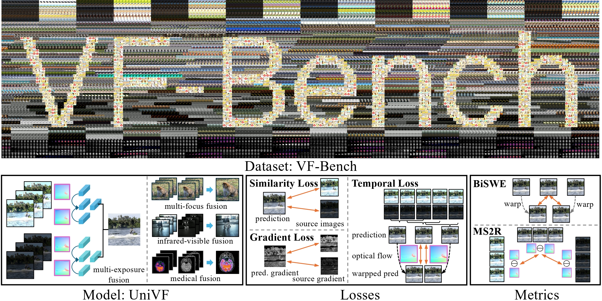

<div align="center">
<h1>A Unified Solution to Video Fusion: From Multi-Frame Learning to Benchmarking</h1>
<h3>NeurIPS 2025 (Spotlight)</h3>

<div align="center" style="line-height:0;">

<!-- 强制去除所有蓝色短横线 -->
<a href="https://vfbench.github.io/" style="text-decoration:none;border:none;outline:none;box-shadow:none;">
  
</a>
<a href="https://arxiv.org/abs/2505.19858" style="text-decoration:none;border:none;outline:none;box-shadow:none;">
  
</a>
<a href="https://share.phys.ethz.ch/~pf/zixiangdata/vfbench/" style="text-decoration:none;border:none;outline:none;box-shadow:none;">
  
</a>
<a href="https://huggingface.co/Zixiang-Zhao/Video-Fusion-UniVF" style="text-decoration:none;border:none;outline:none;box-shadow:none;">
  
</a>

</div>

<p>
<a href="https://zhaozixiang1228.github.io/" style="text-decoration:none;">Zixiang Zhao</a><sup>1</sup>, 
<a href="https://haowenbai.github.io/" style="text-decoration:none;">Haowen Bai</a><sup>2</sup>, 
<a href="http://www.kebingxin.com/" style="text-decoration:none;">Bingxin Ke</a><sup>1</sup>, 
<a href="https://openreview.net/profile?id=~Yukun_Cui2" style="text-decoration:none;">Yukun Cui</a><sup>2</sup>, 
<a href="https://openreview.net/profile?id=~Lilun_Deng1" style="text-decoration:none;">Lilun Deng</a><sup>2</sup>, 
<a href="https://yulunzhang.com/" style="text-decoration:none;">Yulun Zhang</a><sup>3</sup>, 
<a href="https://cszn.github.io/" style="text-decoration:none;">Kai Zhang</a><sup>4</sup>, 
<a href="https://scholar.google.com/citations?user=FZuNgqIAAAAJ&hl=en" style="text-decoration:none;">Konrad Schindler</a><sup>1</sup>
</p>

<p>
<sup>1</sup>ETH Zurich.
<sup>2</sup>Xi'an Jiaotong University.
<sup>3</sup>Shanghai Jiao Tong University.
<sup>4</sup>Nanjing University.
</p>


</div>


## 📢 News
2025-10-07: Code for UniVF is released.<br>
2025-10-03: Dataset VF-Bench is released.<br>
2025-09-18: Paper is accepted to **NeurIPS 2025 (Spotlight)**.<br>
2025-05-26: Paper is on arXiv.<br>

## 🛠️ Setup
The code was tested on: Debian 12, Python 3.10.16, CUDA 12.8, GeForce RTX 4090

### 📦 Repository
```bash
git clone https://github.com/Zhaozixiang1228/VF-Bench.git
cd VF-Bench
```

### 🐍 Python environment
Create python environment:
```bash
# with venv
python -m venv venv/vfbench
source venv/vfbench/bin/activate

# or with conda
conda create --name vfbench python=3.12
conda activate vfbench
```

### 💻 Dependencies
Install dependicies: 
```bash
pip install -r requirements.txt
```
<!-- We also recommand [pyav](https://github.com/PyAV-Org/PyAV) for video I/O, which relies on [ffmpeg](https://www.ffmpeg.org/) (tested with version 5.1.7-0+deb12u1). -->

## 🏃 Run inference demo (for understanding UniVF & for your own videos) 
All scripts are designed to run from the project root directory.

### ⬇ Download pre-trained checkpoints
The checkpoints are hosted on [ETH Cloud](https://share.phys.ethz.ch/~pf/zixiangdata/vfbench/) and [Hugging Face](https://huggingface.co/Zixiang-Zhao/Video-Fusion-UniVF). Use the following script to download the checkpoint weights locally:
```bash
bash src/script/download_univf_checkpoint.sh
```
### 📷 Prepare demo videos
```bash
bash src/script/download_vfbench_demo.sh
```
These example videos are to be used as demo, also shown in our [project homepage](https://vfbench.github.io/).
### 🏃 Run the demo
```bash
bash src/script/test_demo.sh
```
Demo fusion results will be saved under the `output_demo` directory.

## 🚀 Run inference (for academic benchmarking)
### 🎮 Prepare training & test datasets
```bash
# for Multi-Exposure Video Fusion (1080p Version, 274G)
bash src/script/download_vfbench_MEF.sh

# for Multi-Focus Video Fusion Dataset (1080p Version, 40G)
bash src/script/download_vfbench_MFF.sh

# for Infrared-Visible Video Fusion Dataset (6.2G)
bash src/script/download_vfbench_IVF.sh

# for Medical Video Fusion Dataset (63M)
bash src/script/download_vfbench_MVF.sh

# for Multi-Exposure Video Fusion (540p Version, 83G)
bash src/script/download_vfbench_MFF_480P.sh

# for Multi-Focus Video Fusion Dataset (480p Version, 9.6G)
bash src/script/download_vfbench_MFF_540P.sh
```
Alternatively, download manually from [ETH Cloud](https://share.phys.ethz.ch/~pf/zixiangdata/vfbench/) or [Baidu Drive](https://pan.baidu.com/s/1U91bMcnj-4yz2QKxt5XQIw?pwd=akip). 

📂 Directory structure

After setup, your project should look like this:
```
.
├── checkpoint                   # Pre-trained SEA-RAFT optical flow model
│   └── Tartan-C-T-TSKH-spring540x960-S.pth
├── config                       # Configuration files for dataset/training/testing/module
├── data                         # Dataset directory
│   ├── demo                     # Demo data for quick testing / examples
│   ├── IVF                      # Infrared-Visible Fusion datasets
│   │   └── VTMOT.zip
│   ├── MEF                      # Multi-Exposure Fusion datasets
│   │   ├── YouTube-HDR-540P.zip
│   │   └── YouTube-HDR.zip
│   ├── MFF                      # Multi-Focus Fusion datasets
│   │   ├── DAVIS-480P.zip
│   │   └── DAVIS.zip
│   └── MVF                      # Medical Video Fusion datasets
│       └── Harvard.zip
├── output                       # Model outputs
│   ├── UniVF-IVF                # IVF task video fusion model in our paper
│   │   └── checkpoint
│   ├── UniVF-MEF                # MEF task video fusion model in our paper
│   │   └── checkpoint
│   ├── UniVF-MFF                # MFF task video fusion model in our paper
│   │   └── checkpoint
│   ├── UniVF-MFF-480p           # MFF 480p task video fusion model in our paper
│   │   └── checkpoint
│   └── UniVF-MVF                # MVF (medical fusion) task video fusion model in our paper
│       └── checkpoint
├── README.md                     # Project description and instructions
├── requirements.txt              # Python dependencies list
├── src                           # Source code (model, data processing, training)
├── test.py                       # Testing script for evaluation
└── train.py                      # Training script
```

**Tips:**
- The provided benchmark datasets **do not need to be unzipped** — our code supports both ZIP files (e.g., `data/MEF/YouTube-HDR.zip`) and folder structures (e.g., `data/demo`).
- We also provide low-resolution versions (e.g., YouTube-540p, DAVIS-480p), which follow the **same folder structure and data generation pipeline**, just with downsampled frames.
- If you prefer to use the unpacked folder version of a dataset, please follow the same structure as in the extracted ZIP files and update the corresponding path in the configuration file.  
For example, in `config/dataset/IVF/VTMOT/vtmot_5-frame.yaml`, change `dir: IVF/VTMOT.zip` to `dir: IVF/VTMOT`.
- If you use your **own custom dataset**, please modify the corresponding dataset configuration file (e.g., `config/dataset/IVF/VTMOT/vtmot_5-frame.yaml`), and update the frame index file (e.g., `data_split/IVF/VTMOT/LasHeR-107.csv`) as well as the train/test split file (e.g., `data_split/IVF/VTMOT/split.json`).

### 🏄 Inference
- Inference script:
  ```bash
  # for Multi-Exposure Video Fusion (1080p Version, main paper results)
  python test.py --task_name MEF --dataset_name YouTube --exp_path UniVF-MEF

  # for Multi-Focus Video Fusion (1080p Version, main paper results)
  python test.py --task_name MFF --dataset_name DAVIS --exp_path UniVF-MFF

  # for Infrared-Visible Video Fusion (main paper results)
  python test.py --task_name IVF --dataset_name VTMOT --exp_path UniVF-IVF

  # for Medical Video Fusion (main paper results)
  python test.py --task_name MVF --dataset_name Harvard --exp_path UniVF-MVF

  # for Multi-Exposure Video Fusion (540p Version, main paper results)
  python test.py --task_name MEF --dataset_name YouTube-540p --exp_path UniVF-MEF

  # for Multi-Focus Video Fusion(480p Version, main paper results)
  python test.py --task_name MFF --dataset_name DAVIS-480p --exp_path UniVF-MFF-480p
  ```
- Checkpoints are loaded from:
  ```bash
  output/{exp_path}/checkpoint/{ckpt_name}/model.pth
  ```
  where `{ckpt_name}` defaults to `latest`.
- Results are saved under:
  ```
  output/{exp_path}/test_results/{ckpt_name}/
    ├── eval-{dataset}.txt          # Human-readable metrics
    ├── eval-{dataset}.csv          # Metrics table (CSV)
    ├── UniVF_metrics_{dataset}.pkl # Frame-level metrics
    └── eval_visual/                # Visualization results
  ```
- Evaluation results on full-resolution datasets:
  ```
  Task: MEF
  ------------------  ------------------  ------------------  -----------------  ----------------  -------------------
  Metric_VIF          Metric_MEF_SSIM     Metric_MI           Metric_Qabf        Metric_BiSWE      Metric_MS2R
  0.8169179912608882  0.9920238829380325  4.4547776655396225  0.721352632510194  6.40203993923335  0.33265539215658146
  ------------------  ------------------  ------------------  -----------------  ----------------  -------------------

  Task: MFF
  ------------------  ------------------  -----------------  ------------------  -----------------  ------------------
  Metric_VIF          Metric_SSIM         Metric_MI          Metric_Qabf         Metric_BiSWE       Metric_MS2R
  0.7921143580863956  0.8962705603059047  6.319744331473685  0.7913285638675593  5.950949372090284  1.0843105050030248
  ------------------  ------------------  -----------------  ------------------  -----------------  ------------------

  Task: IVF
  ------------------  ------------------  -----------------  ------------------  ------------------  -----------------
  Metric_VIF          Metric_SSIM         Metric_MI          Metric_Qabf         Metric_BiSWE        Metric_MS2R
  0.4439966365032726  0.6424186523704931  2.466450437757704  0.6790498796799607  3.9407282476557626  0.353270259488374
  ------------------  ------------------  -----------------  ------------------  ------------------  -----------------

  Task: MVF
  -----------------  ------------------  -----------------  ------------------  ------------------  ------------------
  Metric_VIF         Metric_SSIM         Metric_MI          Metric_Qabf         Metric_BiSWE        Metric_MS2R
  0.353290323479717  0.7611716830747972  1.999268512089414  0.6781788132262878  29.606275117136093  1.3005935773550277
  -----------------  ------------------  -----------------  ------------------  ------------------  ------------------
  ```
  which can match the results in Table 1-3 in our main paper.

- Evaluation results on downsampled (low-resolution) datasets:
  ```
  Task: MEF (540P)
  ------------------  ------------------  -----------------  ------------------  -----------------  -------------------
  Metric_VIF          Metric_MEF_SSIM     Metric_MI          Metric_Qabf         Metric_BiSWE       Metric_MS2R
  0.7855724298512494  0.9914568397629467  4.383322715695057  0.7257760725131771  6.959616127800861  0.15572928456976848
  ------------------  ------------------  -----------------  ------------------  -----------------  -------------------

  Task: MFF (480P)
  ------------------  ------------------  ----------------  ------------------  -----------------  ------------------
  Metric_VIF          Metric_SSIM         Metric_MI         Metric_Qabf         Metric_BiSWE       Metric_MS2R
  0.7695921974885145  0.9021468445117515  6.34392099623201  0.7871495458890482  8.293007993342428  0.2749553935254134
  ------------------  ------------------  ----------------  ------------------  -----------------  ------------------
  ```
  which can match the results in Table 5 in our supplementary material.

### ⚙️ Inference settings
- Command-line arguments override the default YAML configurations in the `config` directory.
- If you want to modify the train/test split, please edit the corresponding `data_split/<task>/<dataset>/split.json` file, for example:
  ```
  data_split/MEF/YouTube-HDR/split.json
  data_split/MFF/DAVIS/split.json
  data_split/IVF/VTMOT/split.json
  data_split/MVF/Harvard/split.json
  ```
- The results reported in the main paper are obtained using **high-resolution datasets** for both **training and testing**. However, considering potential computational resource limitations, we also report results on **low-resolution datasets** in the supplementary material for reference and comparison.

## 🏋️ Training UniVF
- After successfully preparing the environment and dataset as described above, Run training script:
  ```bash
  # for Multi-Exposure Video Fusion
  python train.py --task_name MEF

  # for Multi-Focus Video Fusion
  python train.py --task_name MFF

  # for Infrared-Visible Video Fusion
  python train.py --task_name IVF

  # for Medical Video Fusion
  python train.py --task_name MVF
  ```
- Training automatically creates an output folder like:
  ```
  output/25_10_07-15_03_14-IVF-crop128-bs32_4-coef1_5_0_2-lr1e-04/
  ├── checkpoint/          # Model checkpoints (saved weights during or after training)
  ├── tensorboard/         # TensorBoard logs
  ├── visualization/       # Visualization results 
  ├── config.yaml          # Full experiment configuration file
  └── code_snapshot.tar.gz # Source code snapshot at training start
  ```
- If you want to resume training, run command like:
  ```bash
  python train.py --task_name MEF --resume_run output/.../checkpoint/step_xxx
  ```
<!-- ### 🔧 Training settings -->


## 🙏 Acknowledgments
We sincerely thank the authors of the following excellent works and datasets that inspired and supported this research:
* Models and Codebases:
  * [SEA-RAFT](https://github.com/princeton-vl/SEA-RAFT)
  * [Marigold](https://github.com/prs-eth/Marigold) & [RollingDepth](https://rollingdepth.github.io/)
  * [VRT](https://github.com/JingyunLiang/VRT) & [RVRT](https://github.com/JingyunLiang/RVRT)
* Original data sources:
  * [VTMOT](https://github.com/wqw123wqw/PFTrack)
  * [YouTube-HDR](https://media.withyoutube.com/sfv-hdr)
  * [DAVIS](https://davischallenge.org/)
  * [Harvard](https://www.med.harvard.edu/AANLIB/home.html)

## 📖 Related image fusion work from our team
* General image fusion:
  * [FILM (ICML'24)](https://zhaozixiang1228.github.io/Project/IF-FILM/); 
  * [ReFusion (IJCV'24)](https://github.com/HaowenBai/ReFusion).
* Multi-modality image fusion:
  * [CDDFuse (CVPR'23)](https://github.com/Zhaozixiang1228/MMIF-CDDFuse); 
  * [DDFM (ICCV'23 Oral)](https://github.com/Zhaozixiang1228/MMIF-DDFM); 
  * [EMMA (CVPR'24)](https://github.com/Zhaozixiang1228/MMIF-EMMA);
  * [TDFusion (CVPR'25 Highlight)](https://github.com/HaowenBai/TDFusion).
* Multi-exposure image fusion:
  * [Retinex-MEF (ICCV'25)](https://github.com/HaowenBai/Retinex-MEF).
* Remote sensing image fusion:
  * [Hipandas (ICCV'25)](https://arxiv.org/abs/2412.04201).

## 🎓 Citation
```bibtex
@InProceedings{zhao2025unified,
    title={A Unified Solution to Video Fusion: From Multi-Frame Learning to Benchmarking},
    author={Zhao, Zixiang and Bai, Haowen and Ke, Bingxin and Cui, Yukun and Deng, Lilun and Zhang, Yulun and Zhang, Kai and Schindler, Konrad},
    booktitle = {Advances in Neural Information Processing Systems (NeurIPS)},
    year={2025}
}
```